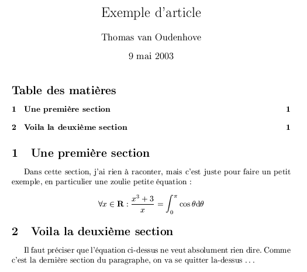
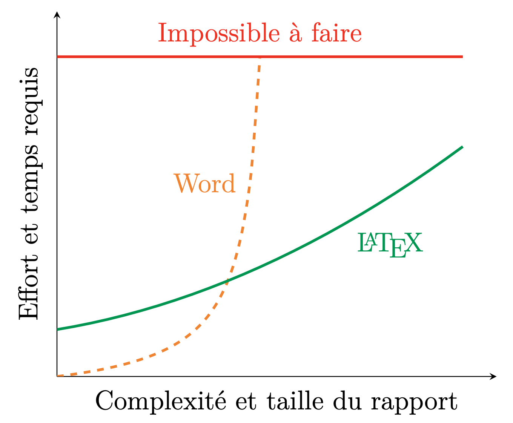

# Charte graphique AOCDTF 

Clean LaTeX template for AOCDTF's educational content intended to highly qualified craftsmen

Canevas de rédaction et support de cours destiné au (gros) chantier de création de contenus pédagogiques pour les formations octroyées à l'AOCDTF. Des directives de rédactions seront ajoutées au fur et à mesure de l'avancement du projet, pour standariser les contenus au mieux et permettre de produire des documents de qualités.
**Pour respecter au mieux la charte graphique, prendre le temps de bien décrypter les instructions dans le [wiki](https://github.com/aocdtf-mta/AOCDTF-template/wiki) est indispensable. Toutes les informations et instructions y sont regroupées.**

## LaTeX en deux mots

Vous avez déjà dû croiser un document typé enseignement à la présentation irréprochable, similaire à d'autres selon les canons graphiques suivants :

	

*Exemple de programmation d'un document LaTeX, code source sur ce [site](https://perso.imt-mines-albi.fr/~vanouden/LaTeX/presentation.html)*

Si oui, vous êtes tombés sur un document rédigé avec LaTeX, un environnement de programmation destiné à la rédaction de documents uniformisés et normalisés.

## Template's features

- système documentaire uniformisé
- mise en page normalisée et harmonisée
- structuration du texte et du document automatique et optimale
- référencement intra/hyperlien et navigation aisée dans le document
- bibliographie type universitaire, création d'index et d'environnements spécifiques listés (définition, formule physique, exemple...)
- intégration _encapsulée_ (tout en conservant les fichiers d'origine) dans les documents de :
	- images haute qualité
	- vidéos
	- vues 3D
	- schémas, graphiques et figures codés, statiques et/ou animés, _uniformes et propriétaires_
- support pédagogique en trois déclinaisons :
	- format imprimable (disposition des chapitre et pages, pas d'éléments multimédias...) sous forme de polycopiés au format PDF très légers
	- format électronique (éléments multimédias, hyperliens...) sous forme de documents au format PDF interactifs visionnables sur ordinateurs et sur tablettes tactiles
	- format présentation (présentation en mot-clés, structure claire et sobre, éléments multimédia...) sous forme de supports projetés de cours (type Powerpoint mais sous format PDF)
- conservation des images, figures, fichiers multimédias... en pleine qualité
- évolutivité de la charte graphique et de la mise en page applicable à tous les documents en une seule mise à jour
- gratuité de l'environnement de programmation
- collaboration aisée sur le code
- pérennité et robustesse du format .tex, documentation très fournie
- langage multiplateforme et intégration avec d'autres langages de programmation et de rédaction (type plateforme d'enseignement en ligne, site internet, formulaire...)

## Pourquoi LaTeX ?

LaTeX, le grand concurrent de Microsoft Word (entre autres logiciels de traitement de texte _WhatYouSeeIsWhatYouGet_) permet la rédaction de document en séparant le format de diffusion (principalement en .PDF) du format de rédaction (principalement du code en .tex). 

Cette caractéristique principale offre diverses fonctionnalités indispensables pour construire une base de données conséquente et _collaborative_ de supports pédagogiques comme cela doit être le cas à l'AOCDTF.
Produire des documents de la sorte - WhatYouSeeIsWhatYouMean - est moins aisé, surtout concernant la production d'un petit nombre de document de faible volume. Toutefois, la courbe apprentissage/vitesse de rédaction de documents tourne relativement rapidement à l'avantage de LaTeX (entre autres logiciels de _programmation_ de texte WYSIWYM) quand il s'agit de rédiger en quantité des documents de plus gros volume :

	

Ce concept se concrétise très clairement dans la gestion du positionnement des images sur le document. Cette fonctionnalité somme toute assez basique est bien mieux gérée sur LaTeX que sur Microsoft Word. En effet, dans MS Word, l'intégration d'images dans un document relativement long peut vite tourner à la prise de tête pour un utilisateur lambda.

Dans le cadre de l'élaboration d'une base de donnée de cours _par formation_ à l'AOCDTF, utiliser LaTeX plutôt que des logiciels de traitements de texte WYSIWYG offre divers avantages :
- uniformité graphique et de mise en page sur **tous** les documents, incluant également **tous** les éléments graphiques, schémas, tableaux...
- interactivité des documents pour le référencement dans une base de donnée adéquate avec suivi des mises à jours
- respect de la norme qualité ISO9001
- mise à jour de la charte graphique simplifiée
- possibilité d'éditer des livres de références
- récupération des cours produits pour Aquis@v utilisant la même structure logicielle

