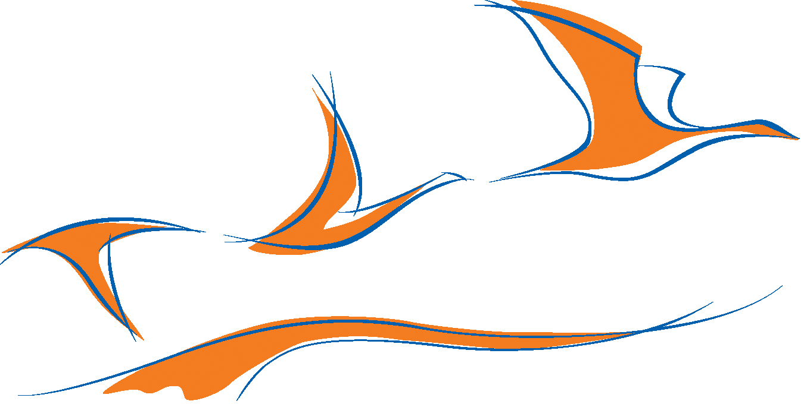

### Charte graphique AOCDTF 

Clean LaTeX template for AOCDTF's educational content intended to highly qualified craftsmen

Canevas de rédaction et support de cours destiné au (gros) chantier de création de contenus pédagogiques pour les formations octroyées à l'AOCDTF. Des directives de rédactions seront ajoutées au fur et à mesure de l'avancement du projet, pour standariser les contenus au mieux et permettre de produire des documents de qualités.
**Pour respecter au mieux la charte graphique, prendre le temps de bien décrypter les instructions dans le _wiki_ est indispensable.**

| Page de couverture  | Page de titre | Page de titre du diaporama |
| :------------------: | :------------------: | :------------------: |
|  |  | |

## _Template's features_

- système documentaire uniformisé
- mise en page normalisée
- structuration du texte et du document automatique et optimale
- référencement intra/hyperlien et navigation aisée dans le document
- bibliographie universitaire, création d'index et liste d'environnements spécifiques (définition, formules physiques, exemple...)
- intégration encapsulée dans le document de :
	- images haute qualité
	- vidéos
	- vues 3D
	- schémas statiques et animés, graphiques et figures codées, uniformes et _propriétaires_
- support pédagogique en trois déclinaisons :
	- format imprimable (disposition des chapitre, pas d'éléments multimédias...) sous forme de polycopiés 
	- format électronique (fichiers multimédias, hyperliens...) sous forme de PDF visionnables sur ordinateurs et sur tablettes tactiles
	- format présentation (présentation en mot-clés, structure claire...) sous forme de support projeté de cours
- conservation des images, figures, fichiers multimédias... en pleine qualité
- évolutivité de la charte graphique et de la mise en page applicable à tous les documents en une seule mise à jours
- récupération des cours produits pour Aquis@v utilisant la même structure logicielle
- gratuité de l'environnement de programmation
- collaboration possible sur le code
- pérennité du format .tex et documentation fournie

## _Template's features_

LaTeX, le grand concurrent de Microsoft Word (entre autres logiciels de traitement de texte _WhatYouSeeIsWhatYouGet_) permet la rédaction de document en séparant le format de diffusion (principalement en .PDF) du format de production (principalement en .tex). 

Cela offre diverses fonctions indispensables pour construire une base de données conséquente et _collaborative_ de supports pédagogiques comme cela doit être le cas à l'AOCDTF.
Produire des documents de la sorte -- WhatYouSeeIsWhatYouMean -- est moins aisé, surtout concernant la production d'un petit nombre de document de faible volume. Toutefois, la courbe apprentissage/vitesse de rédaction de documents tourne relativement rapidement à l'avantage de LaTeX (entre autres logiciels de _programmation_ de texte WYSIWYM) quand il s'agit de rédiger en quantité des documents de plus gros volume :

|  |
